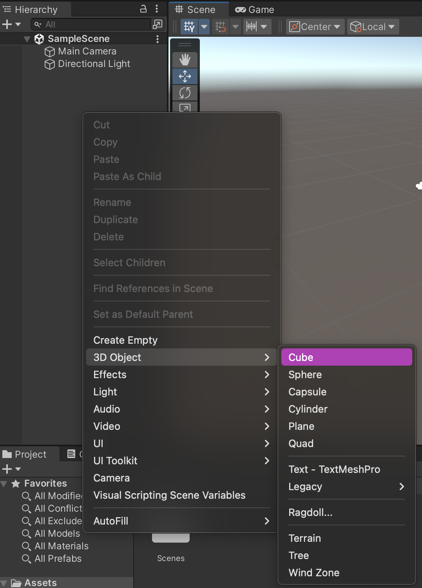
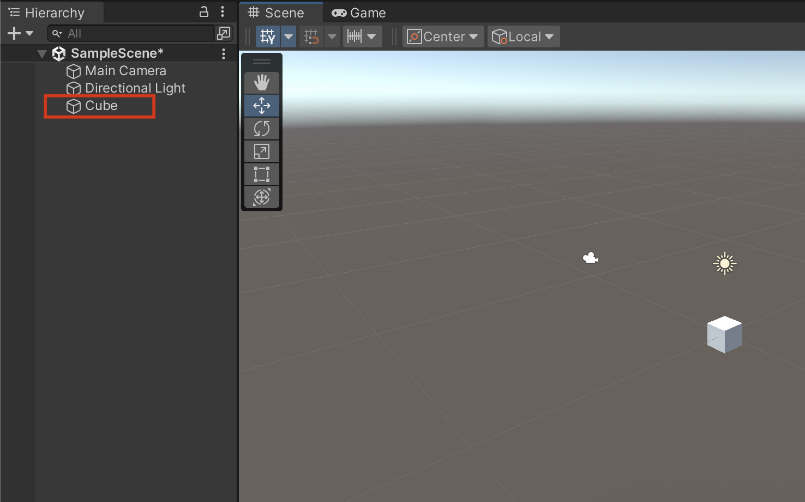

# Unity

By: Natalie Hoffmann, March 17, 2024

In my experience as a CAGD minor, I've had to use Unity in every class I've taken. [Unity](https://unity.com) is a video game engine that allows a person to create video games with much more ease rather than doing it from complete scratch. One of the things about unity is being able to create game objects in the scene, and making changes to that object to fit your needs.

The way to do this is by right-clicking in the hierarchy and selecting the object you want to create. The game object will then be added to the scene and be listed in the hierarchy.

 

Once the object is in the scene, you can rename it, change the position, rotation, and scale, add assets, and change the material. Unity provides multiple different ways to accomplish these tasks, for the most part, which provides veteran users with shortcuts that make creating a scene much faster. 

When adjusting the transform of the object, which is the position, rotation, and scale, you can either type in the inspector the values you wish to have or select the different tools and adjust the object with that. The object's transform is based on the X, Y, and Z axes, with Y representing the verticle positioning of the scene. This has always been something that worked well for my mental model of the 3D space because a 2D graph uses the Y-axis as the verticle axis. 

You can also change the color of the object by either dragging the material onto the object in the scene, dragging it onto the object in the hierarchy, or dragging it onto the object in the inspector.

You can add other attributes to an object by using the inspector or the drag-and-drop method as well.
