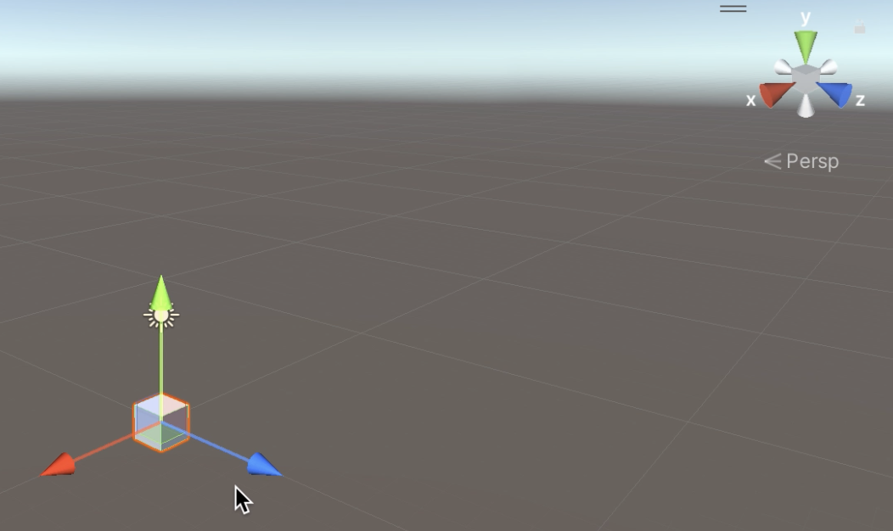
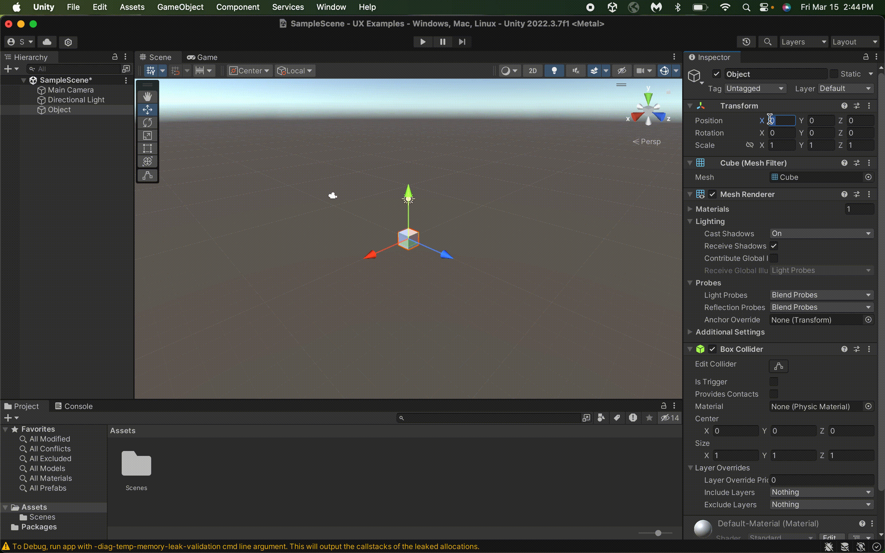
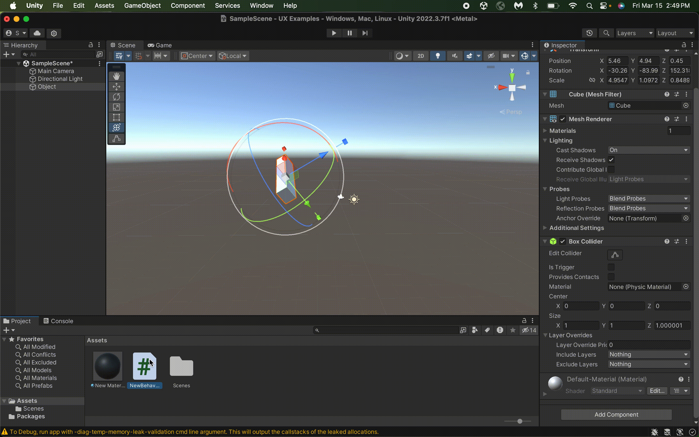
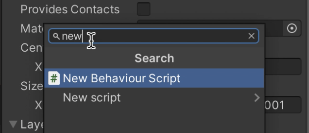

# Unity

By: Natalie Hoffmann, March 17, 2024

In my experience as a CAGD minor, I've had to use Unity in every class I've taken. [Unity](https://unity.com) is a video game engine that allows a person to create video games with much more ease rather than doing it from complete scratch. One of the things about unity is being able to create game objects in the scene, and making changes to that object to fit your needs.

The way to do this is by right-clicking in the hierarchy and selecting the object you want to create. The game object will then be added to the scene and be listed in the hierarchy.

 

Once the object is in the scene, you can rename it, change the position, rotation, and scale, add assets, and change the material. Unity provides multiple different ways to accomplish these tasks, for the most part, which provides veteran users with shortcuts that make creating a scene much faster. 

When adjusting the transform of the object, which is the position, rotation, and scale, you can either type in the inspector window, which shows all the properties of the selected object, or use the tools. The object's transform is based on the X, Y, and Z axes, with Y representing the verticle positioning of the scene, much like how a 2D graph uses the Y-axis as the vertical axis. This provides the software with the quality of **"match[ing] between the system and the real world"**, one of the [10 usability heuristics](https://www.nngroup.com/articles/ten-usability-heuristics/) created by Jakob Nielsen.

When adjusting the transforms of an object, using the tools is much less precise than typing in the values in the inspector, but using the tools helps with making large changes or visualizing before making exact adjustments with the inspector. Like with other applications, you can use Cmd+Z (for Apple) or Ctrl+Z (for Windows) to undo any action, which means that Unity not only provides **"recovery from errors"** but also **"consistency and standards"**, two more of the 10 usability heuristics.

 

Not only are there multiple ways to adjust the transform of an object, but there's a list of ways to add properties to an object.
Drag the property from the project window, which holds all the assets and packages of the Unity project, to the objects name in the hierarchy:  
Drag it from the project window to the object in the scene: 
Select the object and drag it from the project window to the inspector window: 
Search for it in the inspector:  
All these options lead to Unity's success in **"flexibility and efficiency of use"**, yet another one of the 10 usability heuristics, because of all the ways a user can accomplish one task.

You can also change the color of the object by either dragging the material onto the object in the scene, dragging it onto the object in the hierarchy, or dragging it onto the object in the inspector.
